# Grafana消息预警处理

grafana官网文档：https://grafana.com/docs/grafana/latest/

官网中文文档：https://grafana.org.cn/docs/grafana/latest/

别人翻译的文档：https://docs.aws.amazon.com/zh_cn/grafana/latest/userguide/v10-alerting-notifications-go-templating.html

## 1.基本信息

### 1.1架构组成

Grafana 的报警功能基于 **Alerting Rules（报警规则）** 和 **Notification Channels（通知渠道）** 实现，主要涉及以下组件：

- **数据源（Data Source）**: 从 Prometheus、InfluxDB 等数据库获取监控指标数据。
- **可视化看板**: 展示和分析数据的工具，它可以将各种数据源的数据以直观的图表和图形方式呈现出来，帮助用户快速理解和洞察数据背后的信息。
- **报警规则引擎**: 定期评估规则条件，判断是否触发报警。
- **通知处理器**: 将报警信息发送到指定渠道（如邮件、Slack、Webhook 等）。
- **状态存储**: 记录报警的历史状态（如正常、警告、 critical）。

### 1.2 可视化看板(仪表盘)

- **多数据源整合与可视化展示**: 可连接 Prometheus、InfluxDB、MySQL、Elasticsearch 等数十种数据源，统一展示不同来源的数据。
- **实时数据监控与交互:**  支持设置自动刷新频率（如每秒、每分钟），实时展示最新数据变化。

### 1.3报警规则的创建和评估

#### 1.3.1  **规则定义**

- 用户在 Grafana 中为仪表盘（Dashboard）的某个图表创建报警规则，设置：
    - **查询条件**：指定数据源和指标（如 CPU 使用率、请求延迟）。
    - **阈值条件**：例如 “CPU 使用率> 80% 持续 5 分钟”。
    - **报警级别**：通常分为 **警告（Warning）**、**严重（Critical）** 等。
    - **评估周期**：规则多久检查一次（如每 1 分钟）。

#### 1.3.2 周期性评估

- 报警规则引擎按设定的周期（默认 1 分钟）从数据源获取数据，计算查询结果是否满足阈值条件。
- 若条件满足，规则状态从 **正常（OK）** 转为 **报警（Alerting）**；若条件不再满足，状态转回正常。

### **1.4报警状态流转与通知机制**

#### 1.4.1. **状态转换逻辑**

- **Pending**：首次满足报警条件时的过渡状态，避免短暂波动触发误报。
- **Alerting**：条件持续满足时的报警状态，触发通知。
- **OK**：条件不再满足时的正常状态，可发送恢复通知。
- **No Data**：无数据或查询失败时的状态，可配置是否报警。

#### 1.4.2 **通知发送策略**

- **首次报警**：状态从 OK 转为 Alerting 时发送通知。
- **报警持续**：可配置重复通知频率（如每 10 分钟提醒一次）。
- **恢复通知**：状态从 Alerting 转回 OK 时发送恢复消息

### 1.5**通知渠道与消息格式**

#### 1.5.1 **支持的通知渠道**

- **内置渠道**：邮件、Slack、Teams、PagerDuty、Webhook 等。
- **自定义渠道**：通过 Webhook 对接企业内部系统（如钉钉、飞书）。

#### 1.5.2 **消息内容结构**

- 包含报警规则名称、状态、指标值、时间戳、仪表盘链接等信息。
- 支持自定义模板

具体详细介绍请查看官网

## 2.Grafana仪表盘创建

需要配置一下三个核心配置

- 创建数据源

- 创建面板

- 创建仪表盘

### 2.1创建数据源（创建DORIS数据源为例）

Doris数据库可以使用Mysql数据源进行连接,如果没有mysql数据源，需要去插件中下载安装Mysql数据源

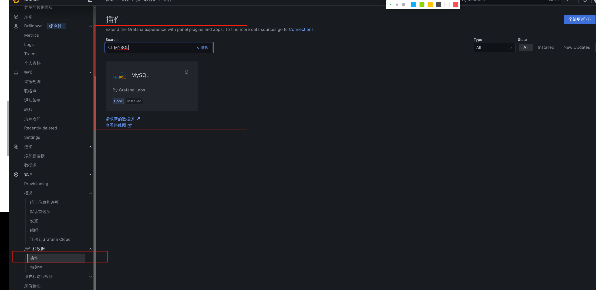

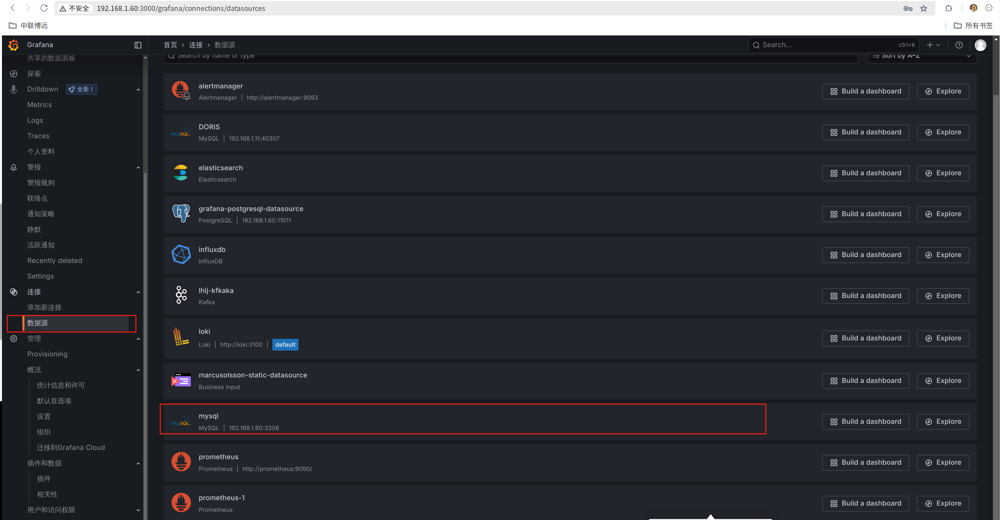

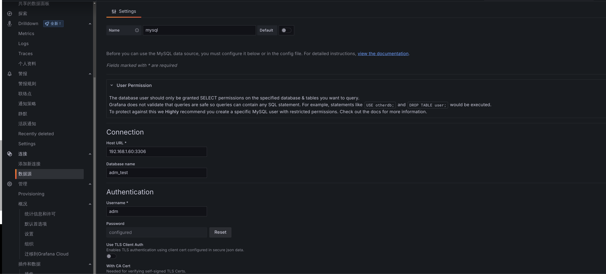

### 2.2创建面板

选择首页-》仪表板-》添加可视化-》填写对应信息即可。

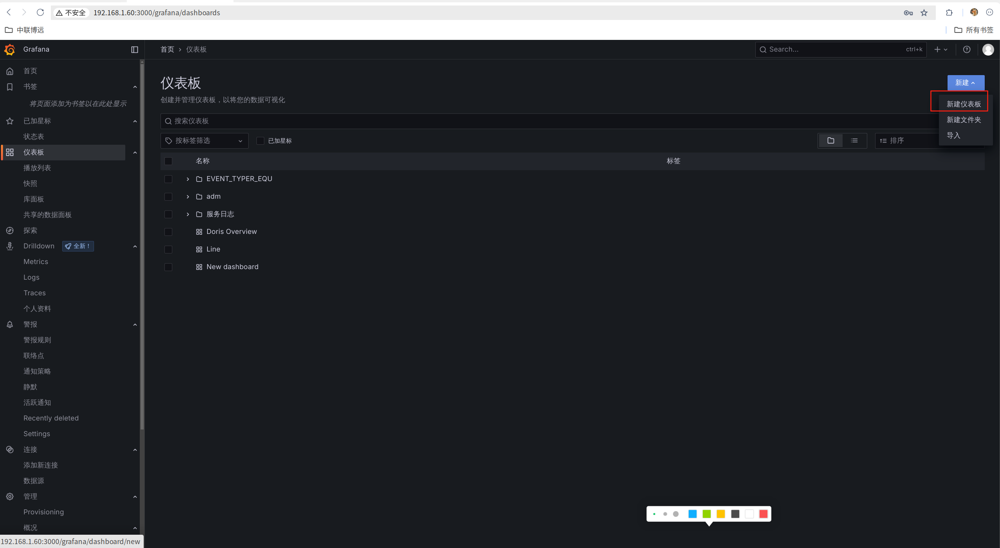

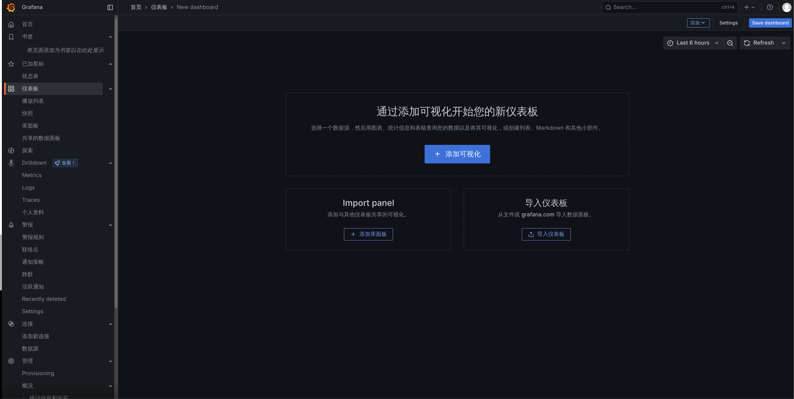

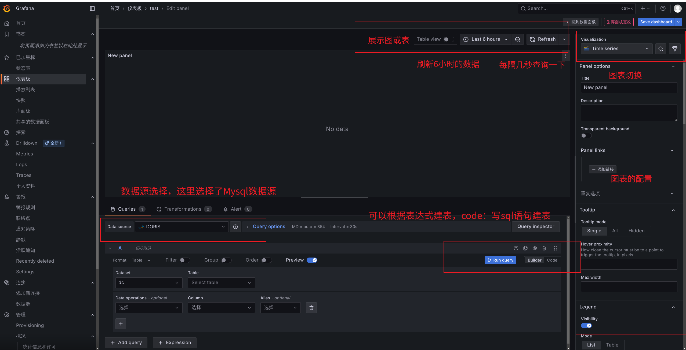

### 2.3 示例

使用dc中的PLC_LOG中的污水001的数据。我都是用code模式，也就是直接贴上sql语句。将写好的sql贴上去之后，点击run
query，然后选择对应的图表即可显示。（如果使用Builder，对于操作数据来说，builder基本是用来分组或者聚合操作的多，不是很方便。如果不做分组或者聚合操作时，使用code更加方便。对于其他数据源来说，使用Builder可能会方便一些）

#### 2.3.1表单

查询dc中的PLC_LOG中的污水001的数据

```
SELECT * FROM dc.PLC_LOG 
WHERE PLC_ID='ws-k37' AND  name = '001'
```

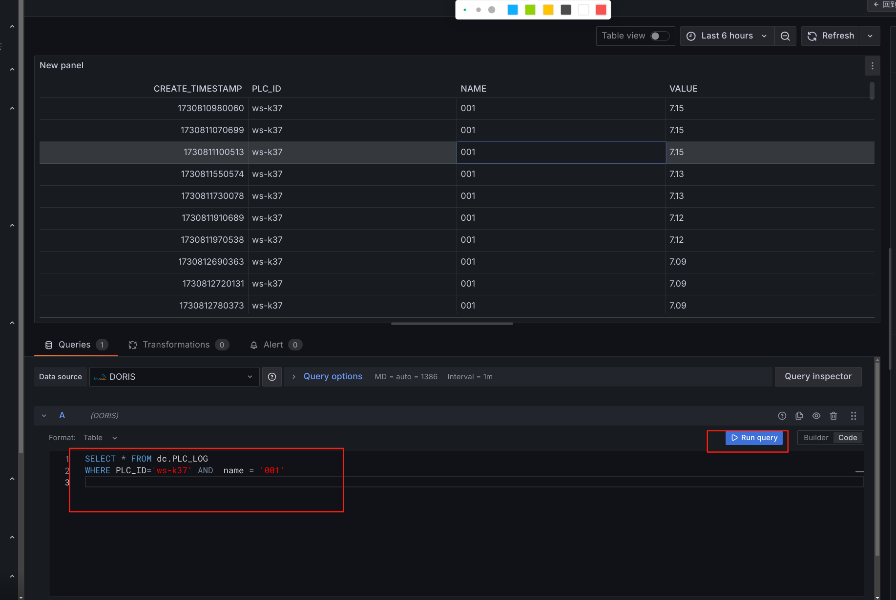

#### 2.3.2柱状图

查询最新的10条污水001的数据，因为VALUE在数据库中时varchar型(渲染图表时不出来)，需要转为整形，将它转为DECIMAL型，为了方便查看日期，将时间戳转为日期时间格式

```
SELECT 
  CAST(VALUE AS DECIMAL(10,2)) AS VALUE,  -- 将VALUE转换为DECIMAL类型，精度为10，小数位2
  FROM_UNIXTIME(CREATE_TIMESTAMP/1000) AS CREATE_DATE
FROM dc.PLC_LOG 
WHERE PLC_ID = 'ws-k37' AND name = '001' 
ORDER BY CREATE_TIMESTAMP DESC
LIMIT 10;
```

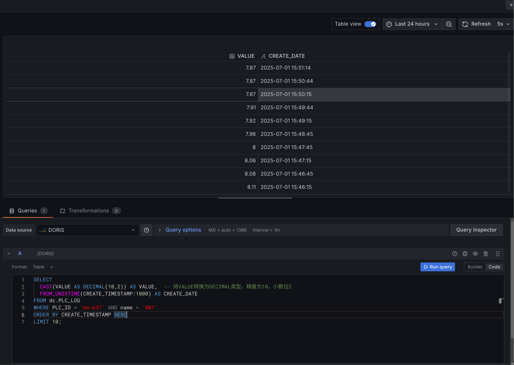

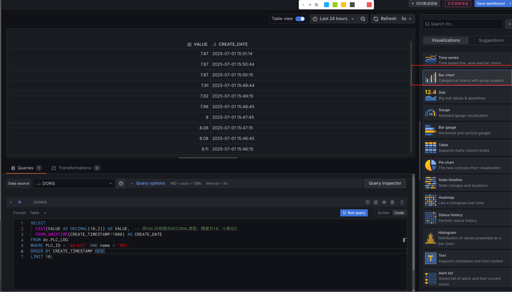

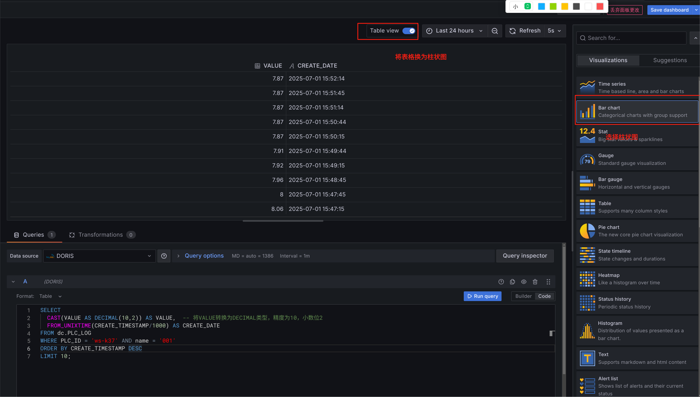

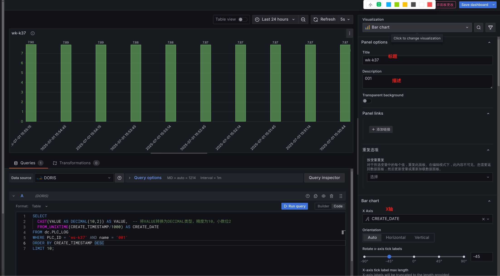

更多配置可以参考官网的，这里就不一一说了

#### 2.3.3 折线图

根据时间范围查询污水001的数据,使用time_sec或者time会将时间戳自动转为date_time格式，属于grafana语法中的根据字

- $__unixEpochFrom() 关键字，获取开始时间

- $__unixEpochTo()：关键字，获取结束时间

- `$__timeGroup` 函数用于将时间范围分组成特定的时间间隔，例如每分钟、每小时、每天等。这个函数通常用于创建时间序列图表，帮助用户将数据按照时间间隔进行聚合和展示。
- `$__timeFilter` 函数用于过滤特定的时间范围，用户可以使用该函数来限制数据的时间范围，例如只显示最近一小时的数据或者只显示某个特定时间段的数据。

除了 `$__timeGroup` 和 `$__timeFilter`，Grafana 还提供了其他与时间相关的内置函数，例如:

- `$__timeFrom()`：用于指定起始时间，可以指定相对时间（例如“now-1h”表示当前时间的一小时前）或绝对时间（例如“2023-11-14T00:00:
  00”表示具体的时间点）。
- `$__timeTo()`：用于指定结束时间，同样可以指定相对时间或绝对时间。
- `$__timeFilterGroup()`：用于根据时间范围过滤数据，并且可以结合其他过滤条件使用

```
SELECT 
  CREATE_TIMESTAMP AS time_sec,          -- 保留原始时间戳（Grafana 自动识别）
  CAST(VALUE AS DECIMAL(10,2)) AS value
FROM dc.PLC_LOG 
WHERE 
  PLC_ID = 'ws-k37' 
  AND name = '001' 
  AND CREATE_TIMESTAMP IS NOT NULL
  AND CREATE_TIMESTAMP >= $__unixEpochFrom() * 1000
  AND CREATE_TIMESTAMP <= $__unixEpochTo() * 1000
ORDER BY time_sec DESC
```

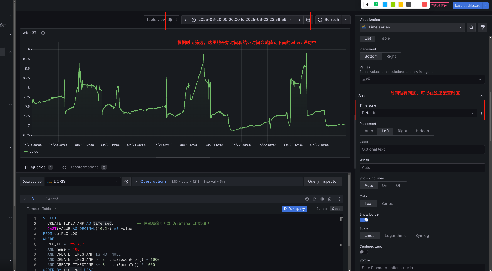

### 2.4高级玩法（数据处理）

可以将数据进行处理，具体怎么处理可以查看官网

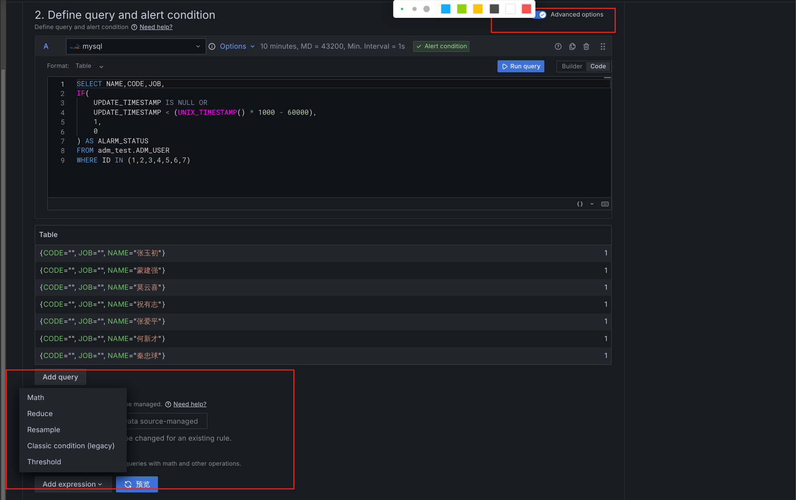

### 2.5扩展

#### 2.5.1仪表板导入

仪表板--->导入

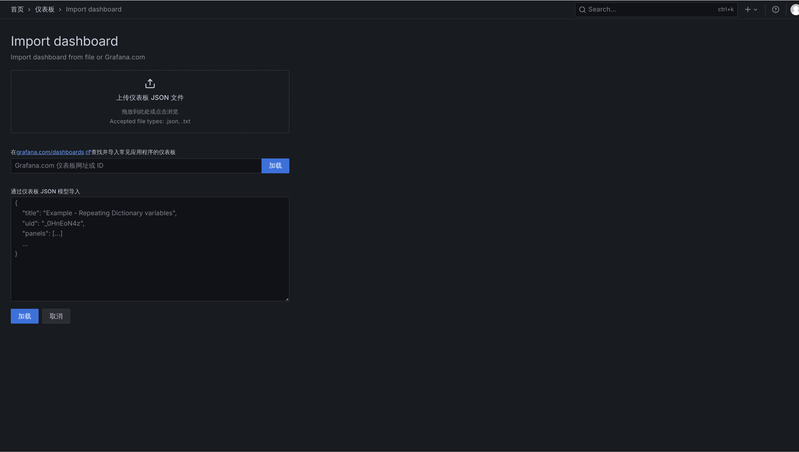

https://grafana.com/grafana/dashboards/打开这个网站，选择要导入的仪表，复制id导入

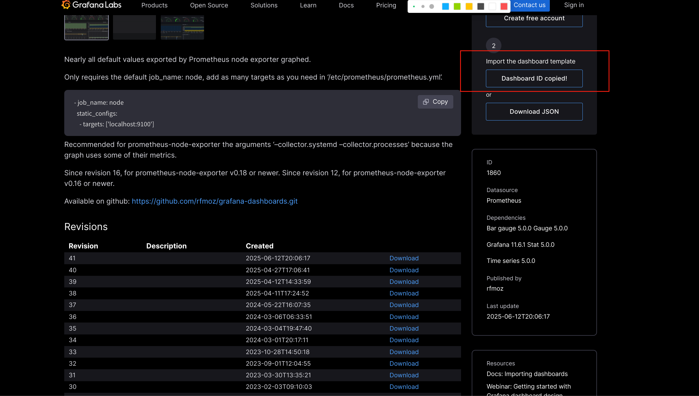

#### 2.5.2Echarts

https://echarts.volkovlabs.io/d/FlnnZ4F4k/treemap?orgId=1&from=now-6h&to=now&timezone=browser,上面有很多集成好的Echarts，导入还支持使用js语句，需要安装BusinessChart组件。

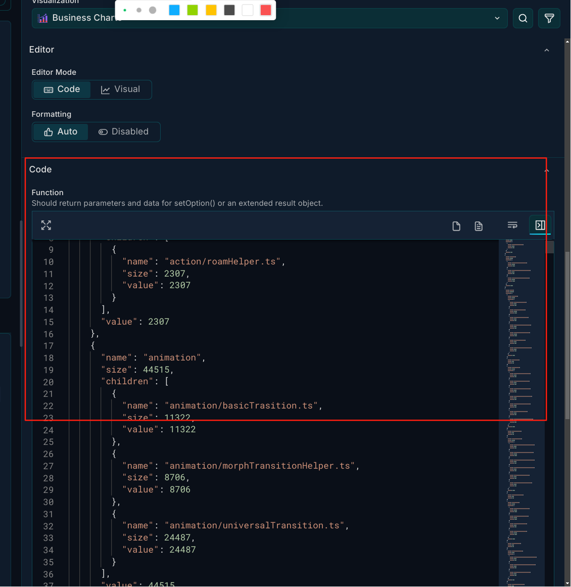

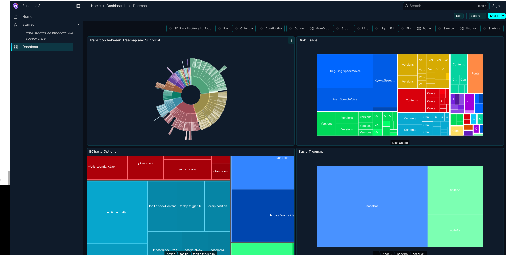

#### 2.5.3面板JSON

它存储了面板的所有设置（如数据源、查询、可视化类型、样式、交互行为等），当面板行为异常时，可以查看JSON定位异常，定位配置差异。

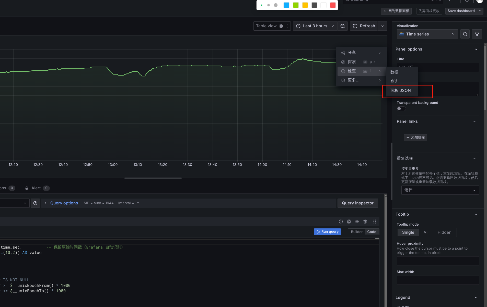

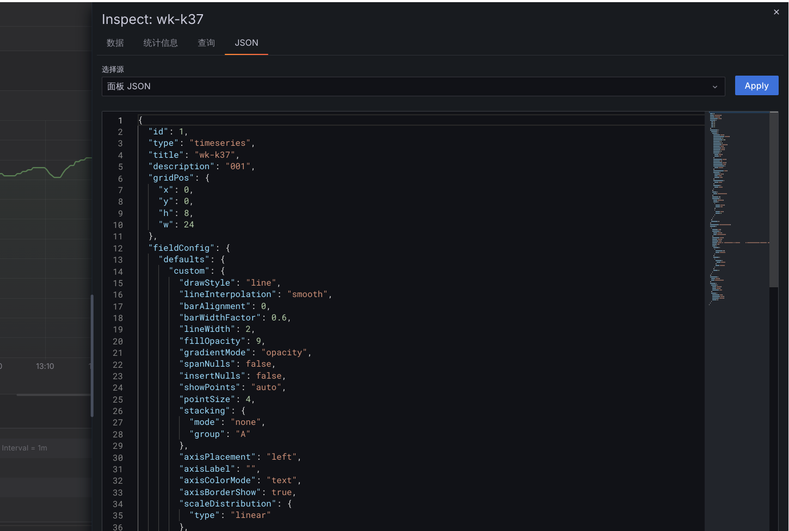

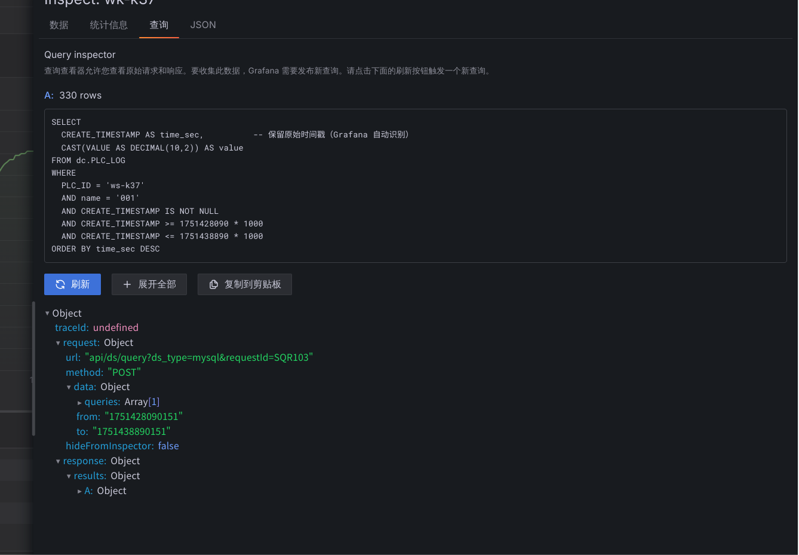

## 3.Grafana告警规则配置

Grafana的告警核心配置:

1. 告警联络点(通知方式，邮件、webhook等)配置；
2. 告警规则(各个图表的规则)配置；
3. 告警通知策略（联络点和规则的关联，告警发送频率、静默配置等）配置;

### 3.1告警联络点配置

#### 3.1.1邮箱配置

需要在配置文件配置，然后在重新启动。具体配置可以查看官网联络点配置https:
//grafana.org.cn/docs/grafana/latest/alerting/configure-notifications/manage-contact-points/

#### 3.1.2Webhook配置

这个配置，可以远程调用api。

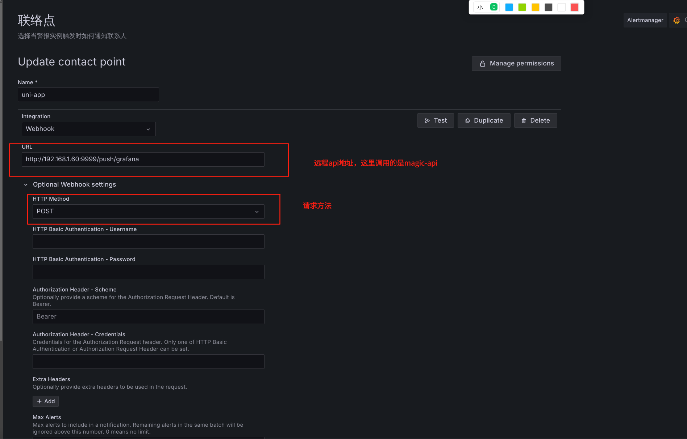

配置完成后，可以点击测试发送，magic-api就会收到请求

报警规则恢复不发送消息

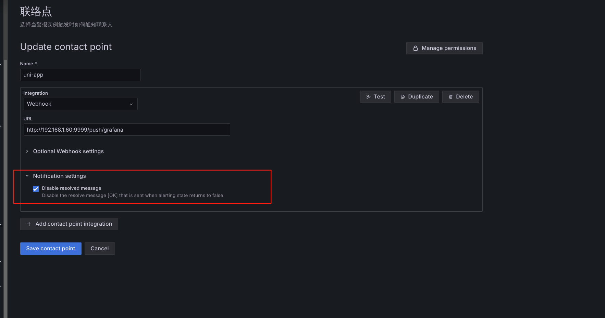

### 3.2告警规则配置

#### 3.2.1设置报警名称

这里对应的msg中的事件配置的编码code

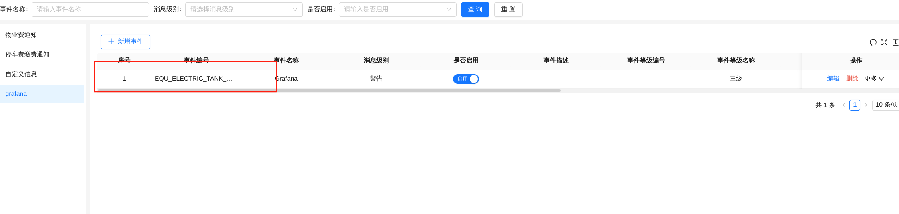

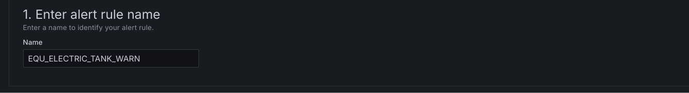

告警的规则创建有两种方式

1. 可以在告警规则面板上面进行规则创建，点击警报-》警报规则(
   如果不太需要图表，建议用这种方法。如果需要图片，也可以创建完报警规则，在创建图表);
2. 也可以在指定监控图表上面创建，点击图表-》edit-》Alert rule;
   创建告警规则，目前的数据源是mysql，因此需要编写sql语法来进行查询，然后配置告警触发条件，然后设置扫描时间，和在某短时间内都触发了就进行告警，还需要配置告警的一些额外信息，告警的主题、描述等等。

1.直接在对应的仪表盘创建报警规则。

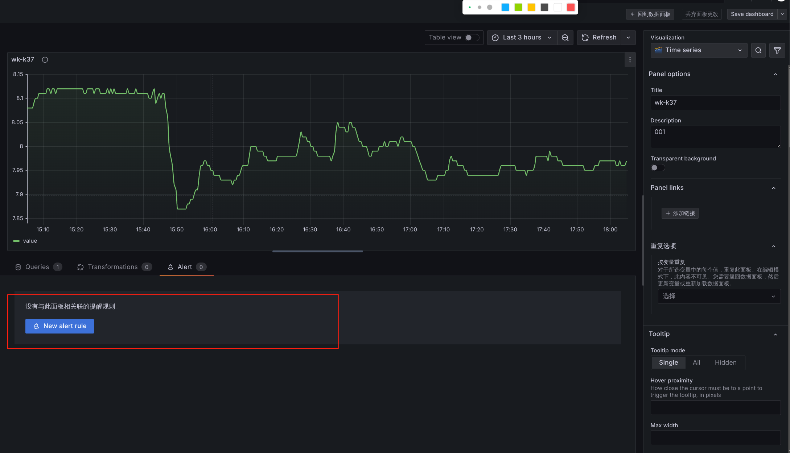

2.在报警规则里面直接创建

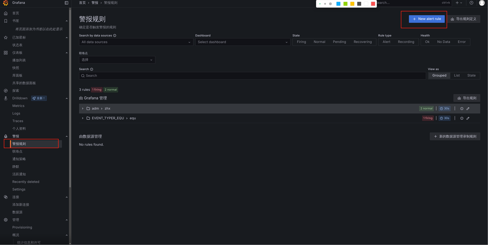

#### 3.2.2创建报警规则

1查询用户id
为1,2,3,4,5,6的更新时间小于60s的数据，如果超过60s没有更新，则为则告警状态ALARM_STATUS标记为1，否则ALARM_STATUS标记为0 。

```
SELECT NAME,CODE ,JOB,
IF(
    UPDATE_TIMESTAMP IS NULL OR 
    UPDATE_TIMESTAMP < (UNIX_TIMESTAMP() * 1000 - 60000),
    1,
    0
) AS ALARM_STATUS
FROM adm_test.ADM_USER
WHERE ID IN ( 1,2,3,4,5,6 )
```

#### 3.2.3设置报警条件

如果告警状态ALARM_STATUS等于1则报警，否则报警

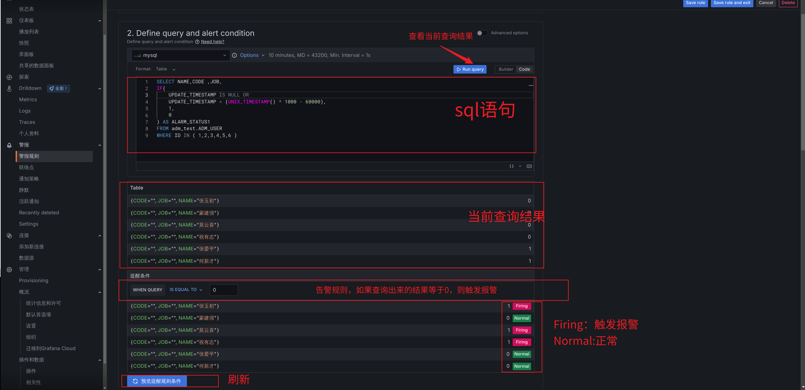

#### 3.2.4选择对应的文件夹或者创建文件夹。

这里需要对应Msg中的事件分类编码

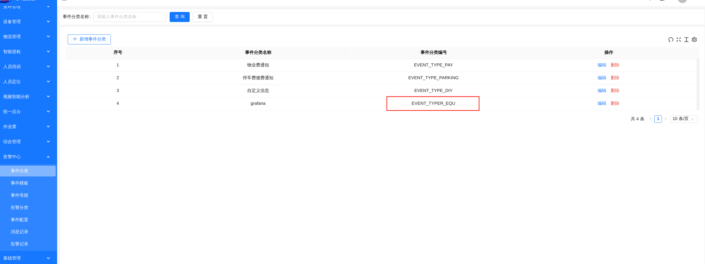、

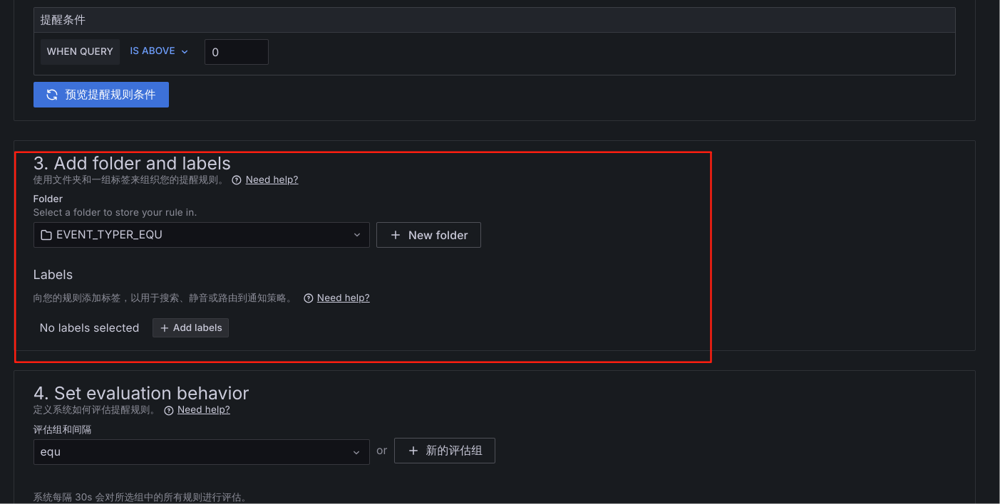

#### 3.2.5定义系统评估和提醒规则

- **评估组（Evaluation Group）**
  是对告警规则进行分组管理的一种方式，每个告警规则都必须属于一个评估组。可以将告警规则分配到现有的评估组，也可以创建新的评估组。每个评估组包含一个评估间隔，用于确定检查告警规则的频率。
- **评估间隔（Evaluation Interval）**是指评估组中告警规则被检查的频率。它决定了 Grafana
  每隔多长时间会去查询数据源的实时数据，并判断告警规则是否满足触发条件。评估间隔可以设置为不同的时间单位，如每秒（s）、每分钟（m）等，例如可以设置为每
  10 秒、30 秒、1 分钟或 10 分钟等。

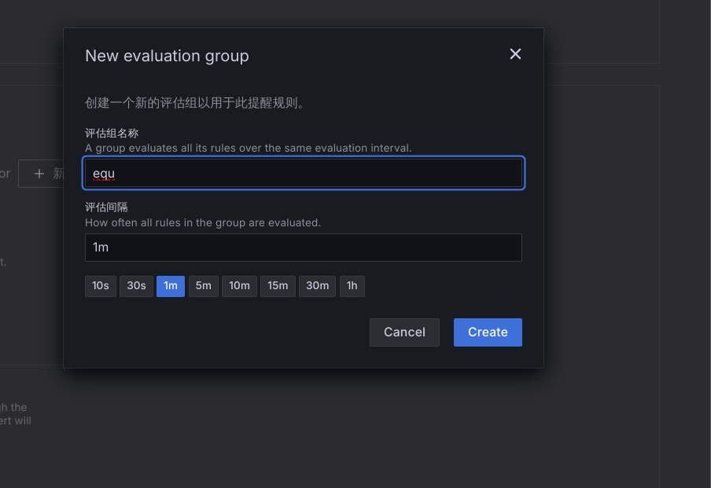

- **等待期（Pending Period）**

它是指在告警规则触发之前，告警条件必须持续满足的时间段，用于防止因临时问题导致的不必要告警。例如，设置等待期为 90 秒，评估间隔为
30 秒，那么当告警条件首次被违反时，告警规则会进入等待状态，直到条件连续满足 90 秒后，才会真正触发告警。

- **持续触发时间(Keep firing for)**

它决定了当告警条件首次被满足后，需要持续多长时间才会真正发送告警通知。以便在阈值不再被突破后仍使告警保持触发状态。这将把告警设置为恢复中状态。在恢复中状态下，即使阈值再次被突破，告警也不会再次触发。然后，持续触发计时器会重置，告警会转换回告警状态。持续触发时间有助于减少由告警抖动（Flapping）引起的重复触发-解决-触发通知场景。

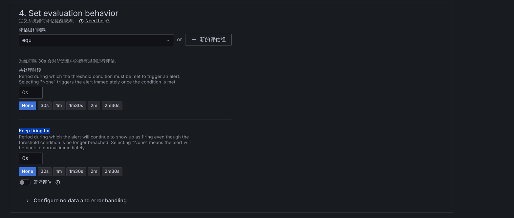

#### 3.2.6 配置通知

这里选择webhook，也可以选择其他接收通知的地方。

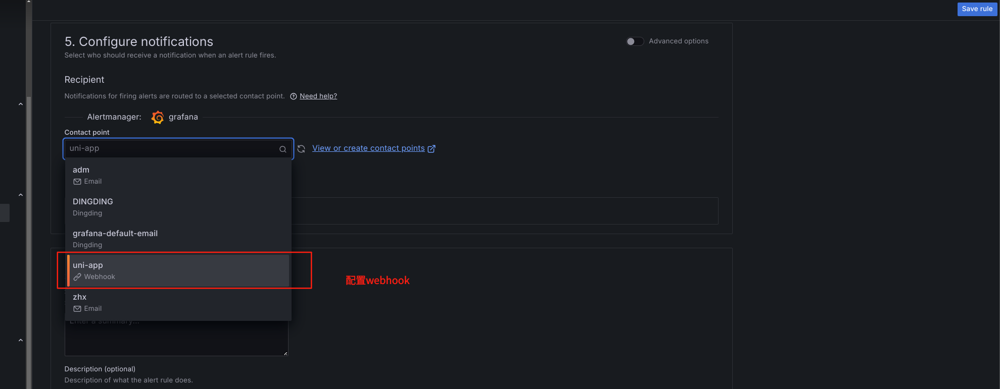

#### 3.2.7配置通知信息

这里可以配置一些描述，或者在这里添加一些字段
点击Add添加字段，和内容。例如，这里加了一个remark的字段。字段内容为测试备注。触发报警会将这些内容放到报警信息中，这里和消息模板有区别，消息模板时渲染报警信息。而这里不受模板影响，都会存在报警信息中。

#### 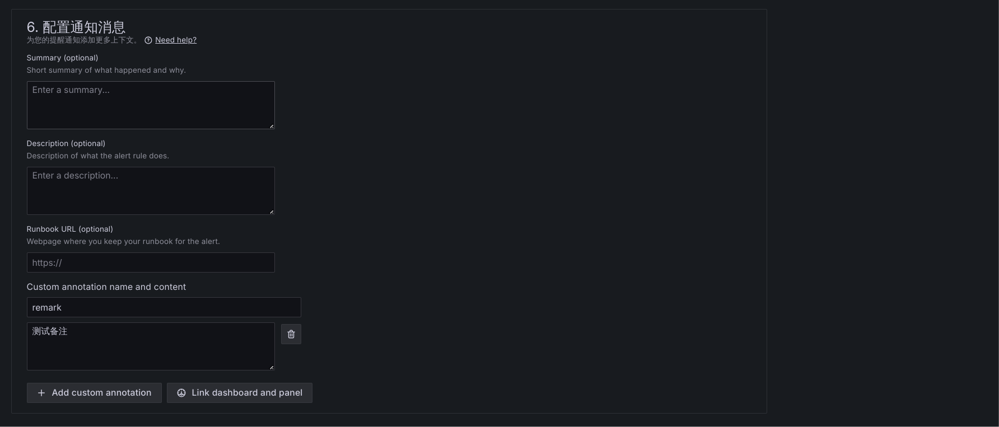3.2.8保存报警规则

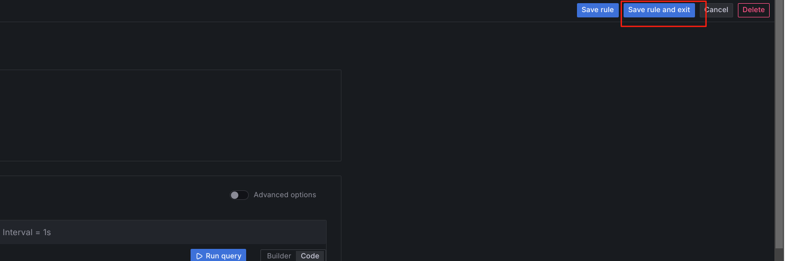

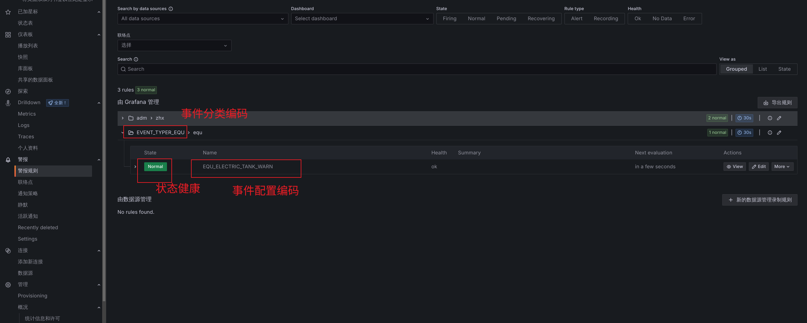

每一个修改告警规则，保存后，状态都会转为健康状态。重新开始监听

#### 3.2.9触发报警

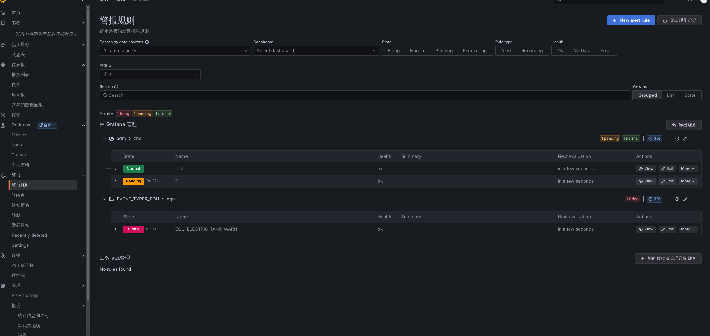

规则名称为T和EQU_ELECTRIC_TANK_WARN为两个相同的触发条件的报警规则。T设置了等待期(Pending Period)
为1min。T触发报警时，状态会有Normal转为Pending。而EQU_ELECTRIC_TANK_WARN没有设置等待期，则状态直接有Normal转为Firing。如果设置了持续触发时间(
Keep firing for),在持续触发时间内报警一直存在。则在持续触发时间结束后。将报警信息发送。

### 3.3通知策略

一种用于控制告警通知如何路由、分组和发送的规则系统。通过配置通知策略，你可以根据告警的严重程度、来源或其他标签，将不同的告警发送到不同的接收渠道（如
Slack、邮件、PagerDuty
等），并自定义通知的格式和频率。如下图，添加通知子策略，选择邮箱zhx，标签输入NAME=张玉初。，在报警规则设置路由。选择高级选项，点击预留路由，可以看到默认报警发送值UNIAPP。如果有NAME=张玉初，报警，则在多发送一个报警消息到zhx邮箱。

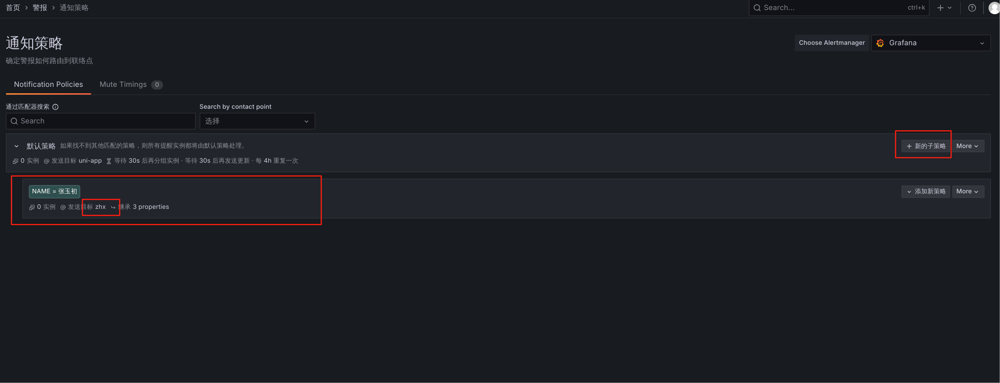

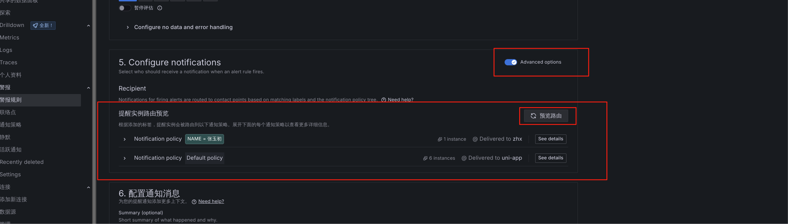

### 3.4消息模板

#### 3.4.1模板的创建

联络点---》Notification Templates
，可以在这里添加模板。语法主要是以GO语言写，具体怎么写可以去grafana官网看一下。也可以先拿到报警的信息，丢给ai给你写模板。这里写的模板，生成的信息会有回车，空格啥的。我在后端msg进行了处理，因为uniapp推送对有些转义符不能识别。

#### 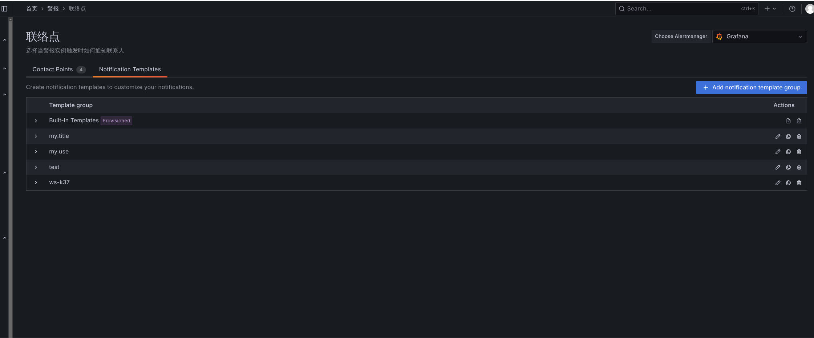

#### 3.4.2消息模板的使用

在创建联络点时使用。

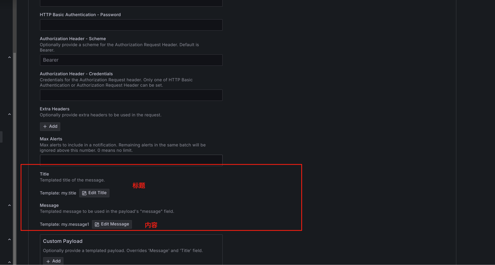

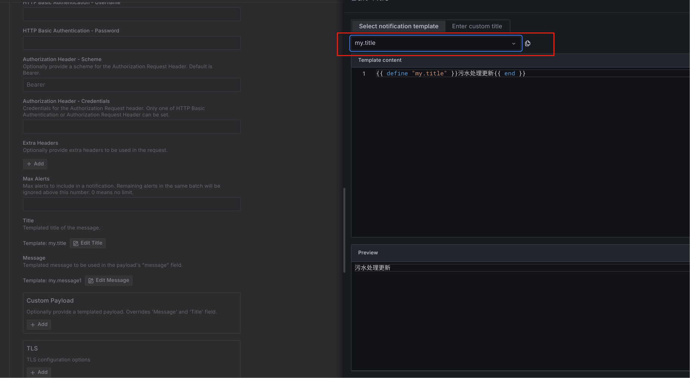

## 4集成magic-api和Msg

### 4.1流程图

具体流程图如下图所示

### 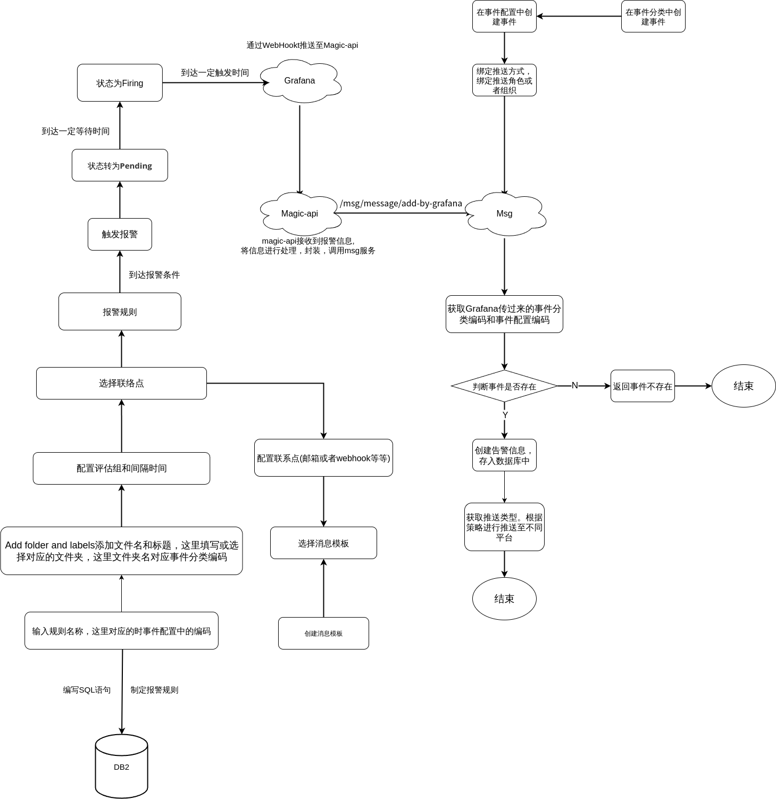4.2接口

magic-api：/push/grafana

主要用于接收granfana传过来的消息，将消息进行处理。然后在转发给Msg

```
import redis;
import http;
import log
import com.fasterxml.jackson.databind.ObjectMapper
import org.bson.json.JsonObject
import com.fasterxml.jackson.databind.util.JSONPObject
ObjectMapper objectMapper = new ObjectMapper();
const tagsDataJsonStr = objectMapper.writeValueAsString(body);

var msg = tagsDataJsonStr::json
var objectList = []
if (msg.message=="" ||msg.message==null){
    return
}
for(val in msg.alerts){
    if (val.status = "firing"){
        val.labels.remove("alertname")
        val.labels.remove("grafana_folder")
        objectList.add(val.labels)
    }
}
   // 使用objectMapper将对象列表转换为JSON字符串
var jsonString = objectMapper.writeValueAsString(objectList);
var msgBody = {
    title : msg.title,   //消息标题
    content: msg.message,     //消息内容
    code: msg.groupLabels.alertname, //事件分类编号
    warnTime: new Date().getTime(), //告警时间
    eventTypeCode: msg.groupLabels.grafana_folder, //事件配置中的事件编号
    variables: jsonString //消息模板中的参数
}

redis.set("test::gra",body)
result = http.connect("http://gateway_svr:19090/msg-svr/msg/message/add-by-grafana").body(msgBody).post().getBody();
```

具体grafana参数

```
{
  "receiver": "uni-app",
  "status": "firing",
  "alerts": [
    {
      "status": "firing",
      "labels": {
        "NAME": "祝有志",
        "alertname": "EQU_ELECTRIC_TANK_WARN",
        "grafana_folder": "EVENT_TYPER_EQU"
      },
      "annotations": {
        "remark": "测试备注"
      },
      "startsAt": "2025-07-02T12:51:00+08:00",
      "endsAt": "0001-01-01T00:00:00Z",
      "generatorURL": "/grafana/alerting/grafana/beq76uzwmxi4ga/view?orgId=1",
      "fingerprint": "f7f672741fcbb6aa",
      "silenceURL": "/grafana/alerting/silence/new?alertmanager=grafana&matcher=__alert_rule_uid__%3Dbeq76uzwmxi4ga&matcher=NAME%3D%E7%A5%9D%E6%9C%89%E5%BF%97&orgId=1",
      "dashboardURL": "",
      "panelURL": "",
      "values": {
        "A": "0",
        "C": "1"
      },
      "valueString": [
        {
          "var": "A",
          "labels": {
            "CODE": "",
            "JOB": "",
            "NAME": "祝有志"
          },
          "value": "0"
        },
        {
          "var": "C",
          "labels": {
            "CODE": "",
            "JOB": "",
            "NAME": "祝有志"
          },
          "value": "1"
        }
      ],
      "orgId": 1
    },
    {
      "status": "firing",
      "labels": {
        "NAME": "莫云喜",
        "alertname": "EQU_ELECTRIC_TANK_WARN",
        "grafana_folder": "EVENT_TYPER_EQU"
      },
      "annotations": {
        "remark": "测试备注"
      },
      "startsAt": "2025-07-02T12:51:00+08:00",
      "endsAt": "0001-01-01T00:00:00Z",
      "generatorURL": "/grafana/alerting/grafana/beq76uzwmxi4ga/view?orgId=1",
      "fingerprint": "b12ce856a55c6a8a",
      "silenceURL": "/grafana/alerting/silence/new?alertmanager=grafana&matcher=__alert_rule_uid__%3Dbeq76uzwmxi4ga&matcher=NAME%3D%E8%8E%AB%E4%BA%91%E5%96%9C&orgId=1",
      "dashboardURL": "",
      "panelURL": "",
      "values": {
        "A": "0",
        "C": "1"
      },
      "valueString": [
        {
          "var": "A",
          "labels": {
            "CODE": "",
            "JOB": "",
            "NAME": "莫云喜"
          },
          "value": "0"
        },
        {
          "var": "C",
          "labels": {
            "CODE": "",
            "JOB": "",
            "NAME": "莫云喜"
          },
          "value": "1"
        }
      ],
      "orgId": 1
    }
  ],
  "groupLabels": {},
  "commonLabels": {
    "alertname": "EQU_ELECTRIC_TANK_WARN",
    "grafana_folder": "EVENT_TYPER_EQU"
  },
  "commonAnnotations": {
    "remark": "测试备注"
  },
  "externalURL": "/grafana/",
  "version": "1",
  "groupKey": {},
  "truncatedAlerts": 0,
  "orgId": 1,
  "title": "污水处理更新",
  "state": "alerting",
  "message": "\n**设备姓名**: 祝有志\n**触发时间**: 2025-07-02 12:51:00 (北京时间)\n\n**设备姓名**: 莫云喜\n**触发时间**: 2025-07-02 12:51:00 (北京时间)\n\n\n"
}
```

msg：/msg/message/add-by-grafana

用与接收Magic-api传入的body。进行处理。
