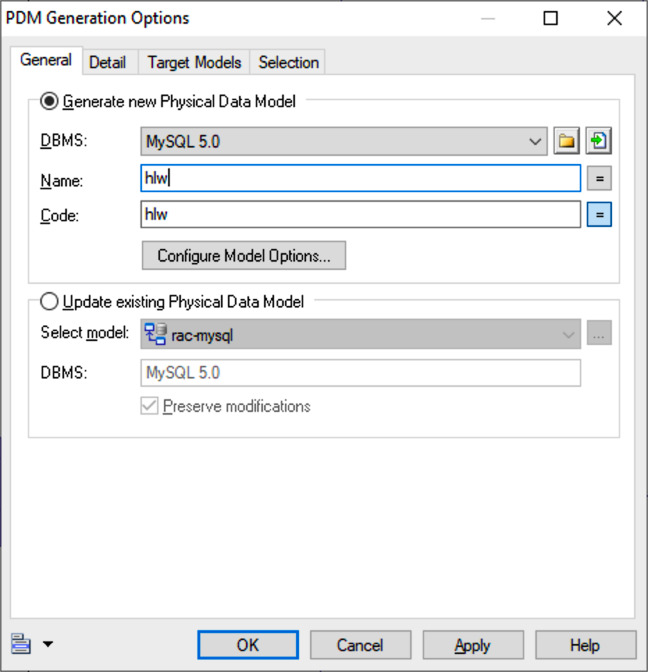

# PowerDesigner建模指南

[TOC]

**建模流程图**

```flow
st=>start: 开始
op1=>operation: 建立工作空间
op2=>operation: 建立项目
op3=>operation: 新建逻辑模型
op4=>operation: 设计逻辑模型
op5=>operation: 生成物理模型
op6=>operation: 补充设计物理模型
op7=>operation: 生成建库脚本
op8=>operation: 建库并执行脚本
e=>end: 结束
st->op1->op2->op3->op4->op5->op6->op7->op8->e
```

## 1. 建立工作空间

与Eclipse的工作空间类型，一个工作空间可以存放多个项目，**规范没有强制要求，只是建议一台电脑就用一个工作空间就好了**

## 2. 建立项目

项目的英文是 `Project`，新建项目请在菜单中选择 `New Project...`，具体操作略

## 3. 新建逻辑模型

逻辑数据模型的英文是 `Logical Data Model`，新建请在菜单中选择 `New Model...` > `Model types` > `Logical Data Model` > `Logical Diagram`，具体操作略

## 4. 设计逻辑模型

- 每个表的code不用加项目前缀（在生成物理模型的时候再设置）
- 表和字段的code大写，单词之间用下划线隔开
- 每个表必须有且有一个关键字段，code为 `ID`，如无特殊要求，数据类型请使用 `Long integer`

## 5. 生成物理模型

打开逻辑模型 > 点击菜单`Tools` - `Generate Physical Data Model...` 或 直接`Ctrl + Shift + p`



**注意，如果是再次生成模型，请选择 `Update existing Physical Data Model` 选项**


**给表名统一设置前缀**


后面操作略

## 6. 补充设计物理模型

在逻辑模型中无法针对具体的数据库特性进行设计，所以要在物理模型中补充设计

### 6.1. 设置unique字段

- 在逻辑模型中设置Identifiers


- 再次生成物理模型时不要选中 `Ext Unique` 的项，以免被覆盖又得重新在物理模型中设置
  

  **建议: 设置生成物理模型时排除unique的比较**
  
  

- 可以在生成脚本后查找脚本中是否有 `   key ` 来检查

### 6.2. 如果是非负数必须设置无符号的unsigned

在MySQL的物理图中 > 双击表 > 在 `Columns` 中选择要更改的字段 > 查看属性 > 切换到MySQL标签页 > 勾选 `Unsigned` > 确定并保存

- 常见的有tinyint,bigint
- 可以在生成脚本后查找脚本中是否有 `bigint not null` 、`bigint  comment` 、 `tinyint not null` 来检查

### 6.3. ID字段的数据类型请使用unsigned

生成的脚本应如下:

```txt
id                   bigint unsigned not null  comment 'XXX',
```

- 可以在生成脚本后查找脚本中是否有 `bigint not null` 来检查

### 6.4. 修改生成外键名称规则

在物理模型生成创建数据库的脚本时，由于原来生成外键的规则问题，生成的外键在表名较长的情况下，有可能会重名

选择 `Database` > `Edit Current DBMS`
选择 `Scripts` > `Objects` > `Reference` > `ConstName`
可以发现右侧的 `Value` 为：
`FK_%.U8:CHILD%_%.U9:REFR%_%.U8:PARENT%`

可见，该命名方法是：'FK_'+8位子表名+9位Reference名+8位父表名，你可以根据这中模式自定义为：
`FK_%CHILD%_AND_%PARENT%`

如果要去除前缀，也可以设置为：

`FK_%5.30M:CHILD%_AND_%5.30M:PARENT%`

**注意，如果无法保存，请使用管理员来打开PowerDesigner**

## 7. 生成建库脚本

点击菜单 `Database` - `Generate Database...`，或者直接 `Ctrl + G`

**注意Formate页面的设置**


具体操作略

## 8. 建库并执行脚本

不同数据库、不同工具，方式各不相同，这里略

### 8.1. 禁用外键约束

在执行脚本删除表时，有可能因为外键而导致删除不了表，这里就要临时禁用外键约束

**MySQL**

```sql
-- 会话内禁用外键约束
SET FOREIGN_KEY_CHECKS = 0;
-- 会话内启用外键约束
SET FOREIGN_KEY_CHECKS = 1;

-- 全局禁用外键约束
SET GLOBAL FOREIGN_KEY_CHECKS = 0;
-- 全局启用外键约束
SET GLOBAL FOREIGN_KEY_CHECKS = 1;
```
