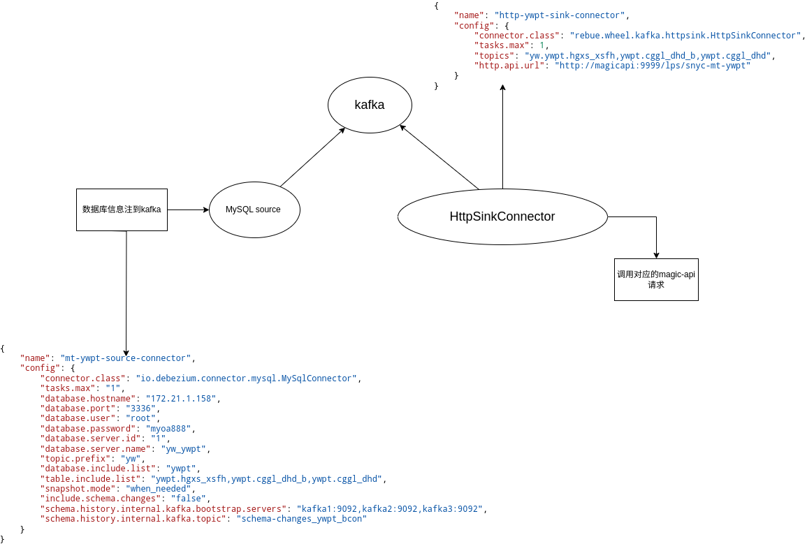
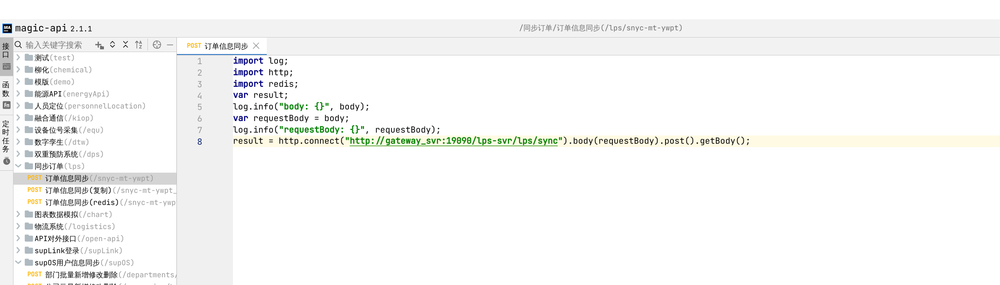
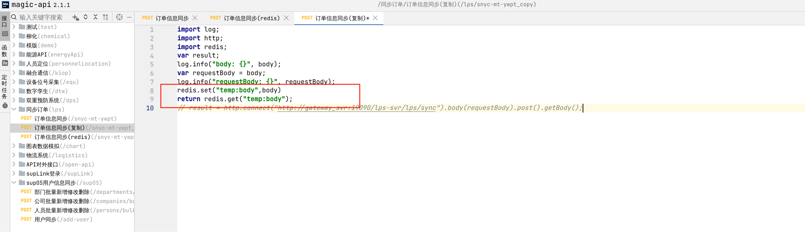
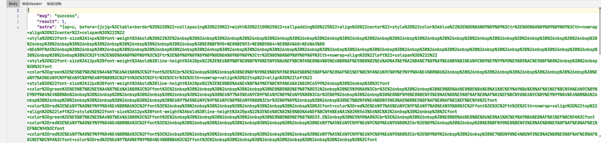

# kafka数据库同步文档

## Kfaka数据同步

原理图:

具体调用查看apifox

注册HttpSinkConnector 具体参数

{

    "name": "http-ywpt-sink-connector", // 【必填】连接器唯一标识名称，用于管理/监控连接器实例

    "config": {

        "connector.class": "rebue.wheel.kafka.httpsink.HttpSinkConnector", // 【必填】指定连接器实现类，这里是自定义HTTP
Sink连接器

        "tasks.max": "1", // 【必填】最大任务并行数，

 // 【必填】要消费的Kafka主题列表（多个主题用英文逗号分隔）

        "topics": "yw.ywpt.hgxs_xsfh,ywpt.cggl_dhd_b,ywpt.cggl_dhd",

        "http.api.url": "http://magicapi:9999/lps/snyc-mt-ywpt"  数据同步接口路径（疑似"sync-mt-ywpt"的拼写错误）

 }

}

注册MySQL source 连接器 参数

{

    "name": "mt-ywpt-source-connector", // 【连接器标识】Debezium MySQL 数据同步任务的唯一名称

    "config": {

 // 【核心配置】---------------------------------------------------------

        "connector.class": "io.debezium.connector.mysql.MySqlConnector", // 必须使用Debezium的MySQL连接器类

        "tasks.max": "1", // 单线程运行（适合中小规模数据变更捕获）

 // 【数据库连接配置】--------------------------------------------------

        "database.hostname": "172.21.1.158", // MySQL服务器IP

        "database.port": "3336", // 非标准端口3336

        "database.user": "root", // 数据库账号

        "database.password": "myoa888", // 数据库密码

 // 【CDC配置】---------------------------------------------------------

        "database.server.id": "1", // 必须唯一，避免与MySQL集群其他节点冲突

        "database.server.name": "yw_ywpt", // 逻辑服务器名称（影响Kafka topic命名）

        "topic.prefix": "yw", // Kafka topic前缀（最终topic命名格式：yw.ywpt.表名）

 // 【数据范围控制】----------------------------------------------------

        "database.include.list": "ywpt", // 只监听ywpt数据库

        "table.include.list": "ywpt.hgxs_xsfh,ywpt.cggl_dhd_b,ywpt.cggl_dhd", // 明确指定监控的三张表

 // 【快照策略】--------------------------------------------------------

        "snapshot.mode": "when_needed", // 智能快照（首次启动或结构变更时自动做快照）

        "include.schema.changes": "false", // 不推送DDL变更到Kafka（避免污染数据流）

 // 【元数据管理】------------------------------------------------------

        "schema.history.internal.kafka.bootstrap.servers": "kafka1:9092,kafka2:9092,kafka3:9092", // 元数据存储集群

        "schema.history.internal.kafka.topic": "schema-changes_ywpt_bcon"  // 结构变更历史topic（需提前创建）

 }

}

magic-api接口

在控制台可以获取到信息redis放回的值

extra中主要包含4个参数

op：操作的类型：u：更新，d:删除，c:插入

after对象：数据库表操作后的数据

before对象：数据库表操作前的数据

source对象：有kafka的一些信息，对应的数据库表信息（多表同步时，可以通过区别）