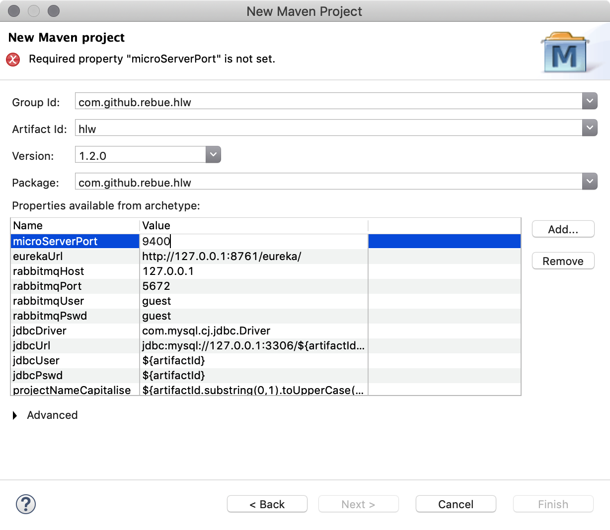

# Rebue微服务开发指南

[TOC]

## 1. 简介

Rebue是一套基于 **SpringCloud** 微服务架构的快速开发框架，特点如下：

- **向导式新建项目**，生成代码简单快捷，把精力集中在数据库设计
- **需求变更**是做项目的家常便饭，如数据库修改可快速、反复生成代码，智能合并已修改代码，**今晚不加班**
- 结构清晰，各层职责分明，设计完全符合面向对象的五大基本原则 (**SOLID**)
- 采用 **按约定编程** 软件开发模式，各种代码及配置已在长期实践中沉淀下来，程序员可将精力集中处理业务逻辑上，只用了解一些微服务的简单概念就能完成开发工作

总结起来就是两点：**快速**，**简单**

## 2. 快速开始

### 2.1. 利用 rebue-archetype 插件快速新建项目

1. `File` > `New` > `Maven Project`
2. `Next >` > 选择 `rebue-archetype` > `Next >`
   
3. 填写下面几项，然后 `Finish`
   - Group Id
   - Artifact Id
   - Version
   - Package **注意包名后面两级可能会重复，去掉最后一级即可**
   - microServerPort **微服务本地调试时用的端口号**

   
4. 项目建成

### 2.2. 数据库设计建模

1. 数据库设计建模(按规范放于db相应目录下)
2. 创建数据库

示例参考: <https://github.com/rebue/hlw/tree/master/db>

### 2.3. 根据数据库结构生成代码

- 运行xxx-gen项目下的XxxGen.java主程序(右击文件 > Run As > Java Application)
- 只要数据结构有改动既可反复生成，但是要**注意，如果代码有过修改，请在修改的时候去掉其上方有注解 `@mbg.generated` 的行，否则重新生成代码时会被覆盖**

### 2.4. 运行

以Spring Boot App方式运行xxx-svr项目(右键单击项目 > Debug As > Spring Boot App)

### 2.5. 测试

运行xxx-svr项目 src/test/java 下的测试程序(右击测试文件 > Run As > Junit Test)，查看日志，检查是否正常通过

## 3. 可能出现的问题

### 3.1. 启动服务器时可能会报 `Connection refused` 的错误

- 出错日志如下:
  
  ```java
  11:56:24,024[ WARN] [DUBBO] Connection refused (Connection refused), dubbo version: 2.7.6, current host: 127.0.1.1[,,,]---org.apache.dubbo.config.ServiceConfig.findConfigedHosts(ServiceConfig.java:592) main
  java.net.ConnectException: Connection refused (Connection refused)
  ....
  ```

- 其实可以忽略(似乎不影响，而且线上没有此问题)
- 如果有强迫症，可以修改配置文件如下

  ```yaml
  dubbo:
    protocol:
      # 指定好当前本机 ip 地址(否则开发环境有可能会报Connection refused的错误)
      host: 192.168.1.143
  
  ....

  # 下面的配置似乎画蛇添足
  spring:
    cloud:
      inetutils:
        # 限定选择前缀为 192 的 ip
        preferred-networks: 192
  ```

- 参考
  <https://www.cnblogs.com/liang1101/p/12702631.html>
