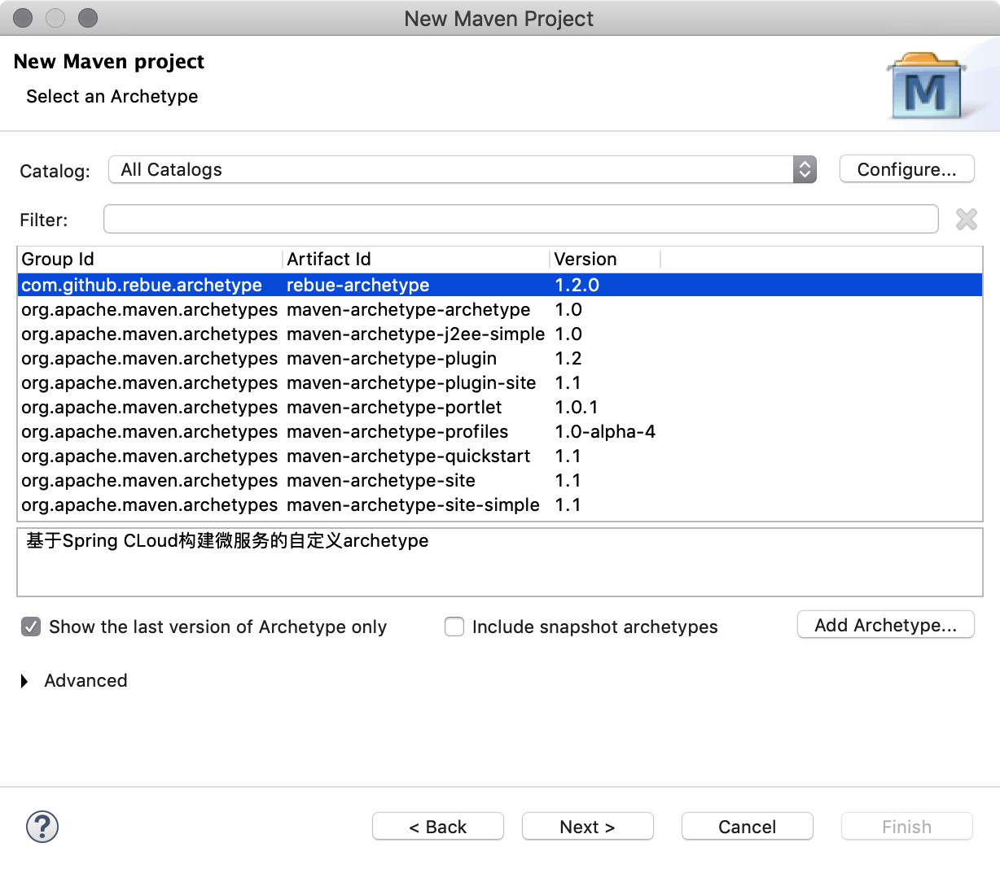
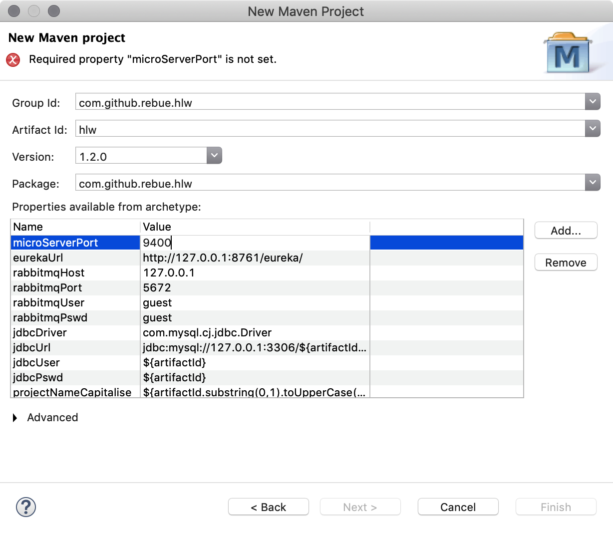

# Rebue微服务快速开发指南

[TOC]

## 1. 简介

Rebue是一套基于 **SpringCloud** 微服务架构的快速开发框架，特点如下：

- **向导式新建项目**，生成代码简单快捷，把精力集中在数据库设计
- **需求变更**是开发过程中的家常便饭，如数据库修改可快速、反复生成代码，智能合并已修改代码，**今晚不加班**
- 结构清晰，各层职责分明，设计完全符合面向对象的五大基本原则 (**SOLID**)
- 采用 **按约定编程** 软件开发模式，各种代码及配置已在长期实践中沉淀下来，程序员可将精力集中在处理业务逻辑上，只用了解一些微服务的简单概念就能完成开发工作

总结起来就是两点：**快速**，**简单**

## 2. 快速开始


### 2.1. 开发所需环境

#### 2.1.1. hostname映射本机

为方便调整各服务器是在本地或是开发服务器，可修改hosts文件

```sh
sudo vi /etc/hosts
```

加入如下内容:

```ini
....

127.0.0.1       mysql
127.0.0.1       rabbitmq
127.0.0.1       redis
127.0.0.1       nacos

....
```

#### 2.1.2. 安装Docker及相关环境

<https://github.com/nnzbz/notes/blob/master/docker/Docker%E5%85%A5%E9%97%A8.md>

#### 2.1.3. 创建虚拟网络

提供给docker容器互联使用

```sh
docker network create --attachable rebue
```

#### 2.1.4. Eclipse

<https://github.com/nnzbz/notes/blob/master/eclipse/%E5%AE%89%E8%A3%85%E4%B8%8E%E9%85%8D%E7%BD%AE/index.md>

#### 2.1.5. 数据库

<https://github.com/nnzbz/notes/blob/master/docker/%E5%B8%B8%E7%94%A8%E9%95%9C%E5%83%8F%E4%B8%8E%E5%AE%B9%E5%99%A8/MySQL.md>

#### 2.1.6. IdWorker生成ID所需的ZooKeeper

<https://github.com/nnzbz/notes/blob/master/docker/%E5%B8%B8%E7%94%A8%E9%95%9C%E5%83%8F%E4%B8%8E%E5%AE%B9%E5%99%A8/Zookeeper.md>

#### 2.1.7. 注册中心和配置中心

<https://github.com/nnzbz/notes/blob/master/docker/%E5%B8%B8%E7%94%A8%E9%95%9C%E5%83%8F%E4%B8%8E%E5%AE%B9%E5%99%A8/Nacos/index.md>

### 2.2. 快速新建项目

利用 rebue-archetype 插件快速新建项目，初次学习请使用 **hlw** 作为项目名

1. `File` > `New` > `Maven Project`
2. `Next >` > 选择 `rebue-archetype` > `Next >`
  
3. 如果没有找到 `rebue-archetype`
   `Preferences` > `Maven` > `Archetypes` > `Add Local Catalog...` > 在 `Catalog File` 项中填写`~/.m2/repository/archetype-catalog.xml` > `OK`
4. 填写下面几项，然后 `Finish`
   - Group Id
   - Artifact Id
   - Version
   - Package **注意包名后面两级可能会重复，去掉最后一级即可**

   
5. 项目建成

### 2.3. 数据库设计与初始化

1. 数据库设计(按规范放于 `/db/model` )
2. 数据库脚本(按规范放于 `/db/script`)
3. 创建数据库
   初次学习，`数据库名/用户名/密码` 请使用项目名，也就是 **hlw**

- 数据库设计及脚本请参考: <https://github.com/rebue/hlw/tree/master/db>

### 2.4. 生成代码

根据数据库结构生成代码

- 运行 **xxx-gen** 项目下的 `XxxGen.java` 主程序(右击文件 > `Run As` > `Java Application`)
- 只要数据结构有改动既可反复生成，但是要**注意，如果代码有过修改，请在修改的时候去掉其上方有注解 `@mbg.generated` 的行，否则重新生成代码时会被覆盖**
- 生成代码后，imports部分并没有organize。这时可以打开 `Package Explorer` 视图 > 选择项目(可以多选) > 按 **Cmd+Shift+O** 即可。

### 2.5. 运行

以 **Spring Boot App** 方式运行 **xxx-svr** 项目(右键单击项目 > `Debug As` > `Spring Boot App`)

### 2.6. 测试

运行 **xxx-svr** 项目 `src/test/java` 下的测试程序(右击测试文件 > `Run As` > `Junit Test`)，查看日志，检查是否正常通过

### 2.7. 生成API文档

Maven Build时，设置Goals为 `clean smart-doc:html` 或 `clean smart-doc:markdown`

### 2.8. 管理API文档

- torna 使用指南请参考: <https://github.com/rebue/archetype/blob/1.2.4/src/main/resources/archetype-resources/doc/torna%E4%BD%BF%E7%94%A8%E6%8C%87%E5%8D%97/index.md>

## 3. 常见问题

### 3.1. 数据库的配置文件在哪里

项目配置文件按SpringCloud规范放在 **xxx-svr** 项目中的 `/src/main/resources/config` 路径下，主要分为开发(dev)和生产(prod)两种环境，数据库的开发环境在 `application-dev.yml` 文件中，而如果是生产环境，则推荐在配置中心配置

### 3.2. 启动服务器时可能会报 `Connection refused` 的错误

- 出错日志如下:
  
  ```java
  11:56:24,024[ WARN] [DUBBO] Connection refused (Connection refused), dubbo version: 2.7.6, current host: 127.0.1.1[,,,]---org.apache.dubbo.config.ServiceConfig.findConfigedHosts(ServiceConfig.java:592) main
  java.net.ConnectException: Connection refused (Connection refused)
  ....
  ```

- 其实可以忽略(似乎不影响，而且线上没有此问题)
- 如果有强迫症，可以修改配置文件如下

  ```yaml
  dubbo:
    protocol:
      # 指定好当前本机 ip 地址(否则开发环境有可能会报Connection refused的错误)
      host: 192.168.1.143
  
  ....

  # 下面的配置似乎画蛇添足
  spring:
    cloud:
      inetutils:
        # 限定选择前缀为 192 的 ip
        preferred-networks: 192
  ```

- 参考
  <https://www.cnblogs.com/liang1101/p/12702631.html>
